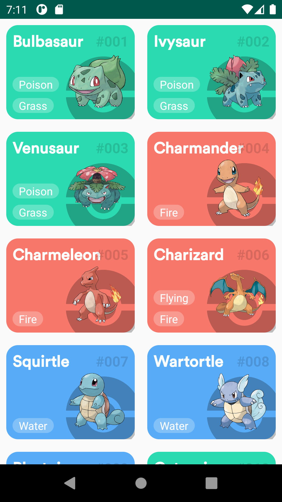

<a name="introduction" />

# Introduction

<a name="overview" />

## Overview

Pokedex List

A  simple application that shows you how to build a screen using the beagle without annotation processor

<a name="showcase" />

## Showcase

  
    

## Requirements

Android Studio 4.1